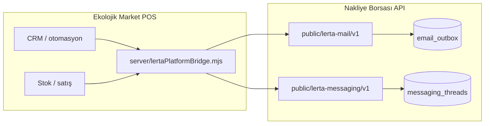

# Ekolojik Market ↔ Nakliye Borsası (Lerta) mail & mesaj entegrasyonu

> **Güncel ürün kararı (2026-10-06):** Nakliye Borsası ve Ekolojik Market **tamamen ayrı** sistemler olacak; ortak mail/mesaj API **hedef değil**.  
> **Geçerli plan:** [PLAN-EKOLOJIK-MAIL-MESAJ-BAGIMSIZ.md](./PLAN-EKOLOJIK-MAIL-MESAJ-BAGIMSIZ.md)  
> Aşağıdaki “paylaşımlı API” metni yalnızca arşiv / alternatif senaryo içindir.

## ~~Amaç~~ (Arşiv — paylaşımlı entegrasyon)

~~- **Nakliye Borsası** … **Ekolojik** aynı Lerta mail + messaging altyapısını kullanır~~

**Yeni amaç:** Bu belgedeki `lertaPlatformBridge` **üretimde kullanılmaz** (`LERTA_PLATFORM_BRIDGE=0` varsayılan).

## Nakliye Borsası — kaynak modüller

| Bileşen | Repo yolu |
|---------|-----------|
| Mail outbox + SMTP | `apps/api/src/modules/notification/*` |
| Public mail API | `MailPublicApiController` → `POST /api/v1/public/lerta-mail/v1/messages` |
| Mesajlaşma | `apps/api/src/modules/messaging/*` |
| Public messaging API | `MessagingPublicApiController` → `/api/v1/public/lerta-messaging/v1/*` |
| Admin | `apps/web` → `/admin/bildirimler` |
| Strateji | `docs/EMAIL_PLATFORM_STRATEGY_ABC.md` |

Kimlik doğrulama (mail + mesaj):

- Header: `Authorization: Bearer <api_key>` veya `x-lerta-mail-api-key: <api_key>`
- Mesaj bot: `x-lerta-messaging-bot-token` (scope: `messaging:read` / `messaging:write`)

## Ekolojik Market — bugünkü durum

| Bileşen | Dosya |
|---------|--------|
| CRM e-posta | `server/crmOutreach.mjs` — Resend veya `data/crm-outbox/pending.jsonl` |
| İletişim formu | `POST /api/contact` → `data/contact-messages.json` |
| CRM UI | `src/store/useStore.ts` → `processCrmOutreachQueue` |
| Fatura mail (IMAP) | `server/billEmailClient.mjs` — stub |

## Hedef mimari



**Kural:** Tarayıcıya API anahtarı verilmez. Tüm çağrılar **Ekolojik `server.mjs` proxy** üzerinden.

## Faz planı

### Faz 1 — Mail (CRM) ✅ başlangıç

1. NB admin: **Ekolojik Market** için ayrı `organization` + mail API key (scope mail gönderimi).
2. Ekolojik VPS `.env`:
   - `LERTA_PLATFORM_API_URL=https://app.lerta.com.tr/api/v1` (veya NB API base)
   - `LERTA_MAIL_API_KEY=...`
3. `sendCrmEmail` → önce `lertaPlatformBridge.sendMail`, yoksa eski Resend/outbox.
4. İdempotency: CRM kuyruk satırı id → `idempotencyKey`.

### Faz 2 — Mesajlaşma (müşteri / tedarik)

1. NB: Ekolojik şirketi için messaging bot veya API key (`messaging:read`, `messaging:write`).
2. Ekolojik: `GET/POST /api/lerta/messaging/*` proxy → `public/lerta-messaging/v1`.
3. POS veya landing: thread listesi + mesaj gönder (nakliye UI’nin sadeleştirilmiş kopyası değil, aynı API).

### Faz 3 — Olay kataloğu

NB `NotificationEventCode` içine `ekolojik.*` olayları (sipariş, stok az, irsaliye) → şablonlar NB admin’den.

### Yapılmayacaklar

- NB `EmailOutboxService` veya messaging servislerinin POS reposuna **dosya kopyası**.
- Üçüncü SMTP hattı (Resend) üretimde — sadece geliştirme fallback.

## NB tarafında yapılacaklar (sizin)

1. Yeni firma: **Ekolojik Market** (veya mevcut şirket altında alt org).
2. **Mail API key** üret → Ekolojik `.env`.
3. (Faz 2) Messaging bot + thread context: `ekolojik-customer-{id}` veya CRM lead id.
4. DNS/MTA zaten Faz A (`notifications@mail.lerta.tr`) — Ekolojik From B fazında `@ekolojikmarket.com.tr` olabilir.

## Ekolojik tarafında yapılacaklar (kod)

- [x] `server/lertaPlatformBridge.mjs`
- [x] `crmOutreach.mjs` bridge entegrasyonu
- [ ] `server.mjs` messaging proxy route’ları
- [ ] CRM UI: “Mesajlar” sekmesi (thread id ↔ müşteri)
- [ ] Contact form → mail outbox event (NB) + mevcut JSON yedek

## Test

```bash
# Mail (NB API ayarlıysa)
curl -s -X POST http://localhost:5180/api/crm/send-email \
  -H 'Content-Type: application/json' \
  -d '{"to":"test@example.com","subject":"Test","body":"Ekolojik bridge"}'
```

NB doğrudan:

```bash
curl -s -X POST "$LERTA_PLATFORM_API_URL/public/lerta-mail/v1/messages" \
  -H "Authorization: Bearer $LERTA_MAIL_API_KEY" \
  -H "Content-Type: application/json" \
  -d '{"to":"test@example.com","subject":"NB test","text":"Merhaba"}'
```
