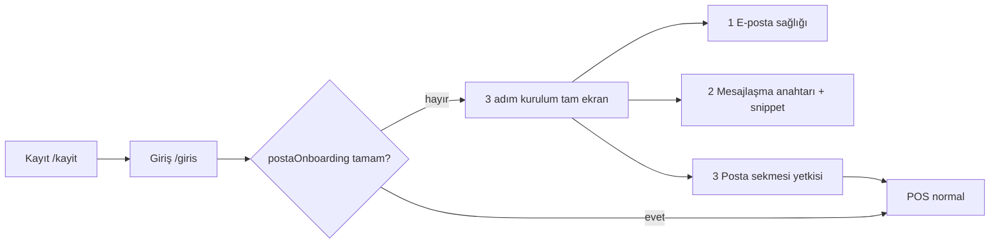

# Ekolojik Market — Kayıt sonrası Posta & Mesajlaşma onboarding (mimari plan)

Bu belge, ürün tarafındaki eksikleri **faz faz** kapatmak için net mimari, veri modeli, ekran akışı ve mevcut/yeni API’leri tanımlar. Uygulama sırası: **Faz 0 → 1 → 2 → 3** (zorunlu), **Faz 4–5** (dokümantasyon + alias’lar).

---

## Mevcut durum (boşluk analizi)

| Konu | Bugün kodda ne var? | Eksik |
|------|---------------------|--------|
| Kayıt | `POST /api/auth/register` → `registerTenant` (`server/tenantAuth.mjs`) | Kayıt **Posta sekmesi**, **IMAP testi** veya **messaging widget** tetiklemez |
| İlk admin sekmeleri | `allowedTabs` içinde `posta` **yok** (satır ~114) | Yeni tenant admin Posta menüsünü göremez |
| Kayıt UI | `LandingRegister.tsx` → `/giris` + `registered: true` | İlk girişte kurulum sihirbazı yok |
| E-posta | Sunucu `.env`: `EKOLOJIK_MAIL_*`, `EKOLOJIK_IMAP_*`; ayarlar `data/posta-mail-settings.json` | **Tenant bazlı** kutu yok; tek VPS kutusu (işletme kutusu) |
| Mesajlaşma site | `GET /api/public/messaging/v1/*` + `EKOLOJIK_MESSAGING_PUBLIC_KEY` (global env) | Tenant’a özel anahtar / kurulum UI yok; `generateMessagingPublicKey()` var ama API’ye bağlı değil |
| Posta kuralları | `data/posta-rules/{tenantId}/rules.json` + varsayılan fatura kuralı | `siparis@` / `fatura@` için hazır kural şablonu onboarding’de önerilmiyor |
| Alias env | `EKOLOJIK_MAIL_ALIASES` → `GET /api/posta/deliverability` | Operatör dokümantasyonu ve sihirbaz adımı eksik |

**Terminoloji (ürün kararı — dokümante edilecek):**

- Kayıt formundaki **e-posta** = işletme iletişim / faturalama adresi (CRM, sözleşme); **kişisel Gmail kutusu değil**.
- Posta Merkezi’nde okunan **Gelen** = sunucuda yapılandırılmış **işletme posta kutusu** (`info@…` veya hosting IMAP kullanıcısı); tüm yetkili personel aynı kutuyu paylaşır (NB/Lerta Posta modeli).
- Müşteri **Sohbet** = `data/messaging/` + isteğe bağlı web sitesi widget’ı (public API anahtarı).

---

## Hedef kullanıcı akışı (özet)



---

## Faz 0 — Veri modeli ve bayraklar

**Amaç:** Onboarding durumunu tenant store’da tutmak; kayıt ile ilişkilendirmek.

### 0.1 `settings.postaOnboarding` (önerilen şema)

`store.json` → `settings` altına:

```json
{
  "postaOnboarding": {
    "version": 1,
    "status": "pending",
    "startedAt": null,
    "completedAt": null,
    "steps": {
      "mailHealth": { "done": false, "skipped": false, "at": null },
      "messagingEmbed": { "done": false, "skipped": false, "at": null },
      "postaTab": { "done": false, "skipped": false, "at": null }
    },
    "registrationEmail": "yonetici@firma.com",
    "notes": ""
  }
}
```

- `status`: `pending` | `in_progress` | `completed` | `dismissed` (ileride “sonra hatırlat”).
- Kayıt sırasında `registrationEmail` = form e-postası (işletme adresi hatırlatması için).

### 0.2 `registerTenant` değişikliği (küçük)

- `createInitialStore` içinde `postaOnboarding` varsayılanı: `status: 'pending'`, `registrationEmail: email`.
- **Karar (ürün):** `allowedTabs` için iki seçenek — dokümanda **B** önerilir:

| Seçenek | Davranış |
|---------|----------|
| A | Kayıtta `posta` ekleme; sihirbaz bitince ekle |
| **B** | Kayıtta `posta` ekle; sihirbaz **ilk girişte** tam ekran (menü görünür ama hub’a girince kurulum) |

### 0.3 Mesajlaşma anahtarı (ileri faz için tasarım)

**Bugün:** tek `EKOLOJIK_MESSAGING_PUBLIC_KEY` (sunucu).

**Hedef (Faz 2b):** `data/messaging/{tenantId}/public-config.json`:

```json
{ "publicKey": "…", "rotatedAt": "…", "enabled": true }
```

Public API tenant çözümlemesi: `X-Ekolojik-Tenant` header veya embed snippet’te `tenantId` + key (mevcut multi-tenant `data/messaging/` ile uyumlu). Geçiş: env key varsa fallback (geriye uyum).

---

## Faz 1 — Sunucu API’leri (onboarding hub)

**Amaç:** Sihirbazın tek kaynaktan okuma/yazma yapması.

| Endpoint | Metot | Kimlik | İş |
|----------|-------|--------|-----|
| `/api/posta/onboarding` | GET | Oturum (admin) | `settings.postaOnboarding` + özet health (SMTP/IMAP/public messaging configured) |
| `/api/posta/onboarding` | PATCH | Oturum (admin) | Adım `done` / `skipped`, `status`, `completedAt` |
| `/api/posta/onboarding/complete` | POST | Oturum (admin) | Tüm zorunlu adımlar → `completed`; isteğe bağlı: primary admin `posta` + oturum `allowedTabs` yenileme |

**Mevcut endpoint’ler (sihirbaz adım 1 — yeniden kullan):**

| Endpoint | Kullanım |
|----------|----------|
| `GET /api/email/health` | SMTP / outbox özeti |
| `POST /api/email/test` (panelde `sendEmailTest`) | Test maili (adım 1 “gönder” butonu) |
| `GET /api/posta/imap/health` | IMAP bağlantı + unseen |
| `GET /api/posta/deliverability` | SPF/DKIM/DMARC + `aliases` + `primaryFrom` |
| `GET /api/posta/settings` | Gönderen adı, ops e-posta (kayıt e-postası ile karşılaştırma metni) |

**Adım 2 — mesajlaşma (yeni veya genişletme):**

| Endpoint | Metot | İş |
|----------|-------|-----|
| `/api/messaging/public-config` | GET | `configured`, `publicKey` (maskeli), `capabilities` URL |
| `/api/messaging/public-config` | POST | `generateMessagingPublicKey()` ile rotate (admin) |
| `GET /api/public/messaging/v1/capabilities` | GET | Widget’ın “API açık mı?” kontrolü |

**Adım 3 — Posta sekmesi:**

| Mekanizma | Detay |
|-----------|--------|
| `store.updateUser` (mevcut istemci) | Primary admin için `allowedTabs` içine `posta` |
| **Yeni:** `POST /api/posta/onboarding/grant-tab` | Sunucu tarafı: `isPrimaryAdmin` kullanıcıya `posta`; JSON store persist (sync API varsa ona bağlanır) |

> Not: POS kullanıcı güncellemesi bugün `useStore` üzerinden tenant `store.json` yazıyor; onboarding complete aynı kod yolunu kullanmalı (tek kaynak).

---

## Faz 2 — İstemci: 3 adımlı kurulum ekranı

**Konum:** `src/components/onboarding/PostaOnboardingWizard.tsx` (yeni).

**Tetikleyiciler:**

1. İlk giriş: `authSession` + `GET /api/posta/onboarding` → `status !== 'completed'`.
2. `PosApp.tsx` veya `AppShell`: tam ekran overlay / route `/kurulum/posta` (deep link).
3. Kayıt sonrası: `LandingRegister` → `/giris?onboarding=posta` veya giriş state `openPostaOnboarding: true`.

### Adım 1 — “İşletme e-postanız hazır mı?”

**UI:**

- Bilgi kutusu: *Kayıt e-postanız kişisel kutu değil; işletme iletişim adresinizdir. Gelen kutusu sunucuda yapılandırılan `info@…` hesabıdır.*
- Kartlar: SMTP (health), IMAP (health), DNS (deliverability özet).
- Aksiyon: “Test e-postası gönder” → kayıt e-postası veya ops alanı.
- **Geç:** “Sunucu yöneticim hallediyor” → `mailHealth.skipped = true`.

**API çağrıları:** `fetchEmailHealth`, `GET /api/posta/imap/health`, `fetchPostaDeliverability`, isteğe bağlı `sendEmailTest`.

### Adım 2 — “Mesajlaşmayı siteye ekleyin”

**UI:**

- Public key göster (kopyala) veya “Anahtar oluştur” (Faz 2b API).
- Hazır **embed snippet** (örnek):

```html
<script src="https://ekolojikmarket.com.tr/widget/messaging.js" defer></script>
<script>
  EkolojikMessaging.init({
    tenantId: '…',
    apiKey: '…',
    apiBase: 'https://ekolojikmarket.com.tr/api/public/messaging/v1'
  });
</script>
```

- Link: Ayarlar → E-posta (bildirim matrisi `messagingOpsEmail`).
- **Geç:** “Sadece POS içi sohbet” → `messagingEmbed.skipped`.

**API:** `GET/POST /api/messaging/public-config`, `GET /api/public/messaging/v1/capabilities`.

### Adım 3 — “Posta sekmesini aç”

**UI:**

- Checkbox: Birincil yöneticiye Posta sekmesi (varsayılan işaretli).
- İsteğe bağlı: diğer kullanıcılar (liste `UsersManagement` ile aynı veri).
- Bitir → `POST /api/posta/onboarding/complete` → yönlendir `?page=posta` veya Posta hub.

**API:** onboarding complete + `store.updateUser` / grant-tab.

### UX kuralları

- Sihirbaz kapatılırsa `status: in_progress`; üst bant veya Ayarlar’da “Kurulumu sürdür”.
- `admin` rolü dışında gösterilmez.
- Kasiyer `posta` görmemeye devam eder (yetki modeli değişmez).

---

## Faz 3 — Admin varsayılan `posta` sekmesi (politika)

| Politika | Uygulama |
|----------|----------|
| **Önerilen** | Seçenek B: kayıtta `allowedTabs`’a `posta` ekle; sihirbaz bilgilendirme + health |
| **Alternatif** | Seçenek A: sihirbaz adım 3’te ekle; kayıtta menüde Posta gizli |
| Mevcut `main` tenant | Migration script: primary admin’e `posta` ekle (bir kerelik) |
| `DEFAULT_USERS` / `defaultUsers.ts` | Demo `yonetici` için `posta` ekle (geliştirme paritesi) |

`UsersManagement`: `role === 'admin'` zaten `ALL_APP_PAGES` (içinde `posta`) — yeni kayıt admin listesi hariç tutulduğu için onboarding şart.

---

## Faz 4 — Dokümantasyon

| Dosya | İçerik |
|-------|--------|
| `docs/EKOLOJIK-POSTA-KULLANIM.md` | “İşletme kutusu ≠ kişisel mail” bölümü (kayıt e-postası vs IMAP kullanıcısı) |
| `docs/EKOLOJIK-POSTA-ONBOARDING-OPERATOR.md` (yeni) | Sihirbaz adımları, geçişler, VPS env checklist |
| `docs/ENTEGRASYON-LERTA-MAIL-MESAJ.md` | Onboarding’e referans |

**Operatör metni (özet):**

> Size verilen `info@ekolojikmarket.com.tr` (veya hosting hesabı) **mağazanın ortak posta kutusudur**. Yönetici kişisel Outlook/Gmail hesabını bu alana bağlamayın; kayıt formundaki e-posta yalnızca iletişim ve bildirimler için kayıtlıdır.

---

## Faz 5 — İsteğe bağlı: `siparis@`, `fatura@` alias’ları

**Seçenekler (öncelik sırası):**

1. **Hosting catch-all / alias** → tek IMAP kullanıcı; Posta kurallarında `toContains` / `fromContains` (motor v2 `matchGroups` — `server/postaRules.mjs`).
2. **`EKOLOJIK_MAIL_ALIASES`** — deliverability hub’da listelenir; onboarding adım 1’de “önerilen alias’lar” göster.
3. **Fatura modülü `plus_alias`** — `billEmailClient.mjs` `inboxMode: 'plus_alias'` (mevcut); `info+siparis@` forwarding.

**Onboarding şablon kuralları (PUT `/api/posta/rules`):**

- `siparis@` veya konu `sipariş` → etiket `siparis` (ileride klasör).
- `fatura@` → mevcut `routeToFatura: true` kuralına ek `fromContains`.

**Kabul:** Aynı IMAP’ten sync; kurallar tenant `posta-rules` dosyasında; ek MX kutusu gerekmez.

---

## Faz 6 — İleri (multi-tenant gerçek posta kutusu)

Şu an **Faz 0–5** tek VPS / tek `.env` ile uyumlu. İleride tenant başına SMTP/IMAP:

- `data/tenants/{id}/mail-env.json` veya secrets vault
- `getEkolojikMailConfig(tenantId)` refactor
- Onboarding adım 1: tenant admin kendi IMAP bilgisini girer (şifreli saklama)

Bu faz **ürün planı dışı**; onboarding şeması `mailHealth` adımına “tenant credentials” alt tipi eklenerek genişletilebilir.

---

## Uygulama checklist (geliştirme sırası)

- [x] **0** — `postaOnboarding` şeması + `registerTenant` seed + kayıtta `posta` sekmesi (politika B)
- [x] **1** — `GET/PATCH /api/posta/onboarding` + `POST …/complete` (`server/postaOnboarding.mjs`)
- [x] **2** — `PostaOnboardingWizard` + `PosApp` gate (Faz 2 — temel UI)
- [x] **2b** — `GET/POST /api/messaging/public-config` + tenant key (`data/messaging/{tenant}/public-config.json`, env fallback)
- [x] **3** — `allowedTabs` politikası (B) + `defaultUsers` + `migrateLegacyPostaOnboarding` + deploy script
- [x] **4** — `EKOLOJIK-POSTA-ONBOARDING-OPERATOR.md` + kılavuz / entegrasyon linkleri
- [ ] **5** — onboarding’de alias + varsayılan kural şablonları

---

## İlgili kod referansları

| Alan | Dosya |
|------|--------|
| Kayıt | `server/tenantAuth.mjs`, `src/landing/LandingRegister.tsx` |
| Posta yetki | `src/PosApp.tsx` (`allowedTabs.includes('posta')`) |
| Nav | `src/data/navigation.ts` |
| Posta API | `server.mjs` (`/api/posta/*`) |
| Public mesaj | `server/messaging/publicApi.mjs` |
| Kurallar | `server/postaRules.mjs` |
| Ayarlar UI | `src/components/settings/EmailOutboxSettingsPanel.tsx` |

---

*Son güncelleme: kayıt sonrası Posta/Mesajlaşma onboarding mimari taslağı — uygulama PR’ları bu checklist’e göre açılacak.*
