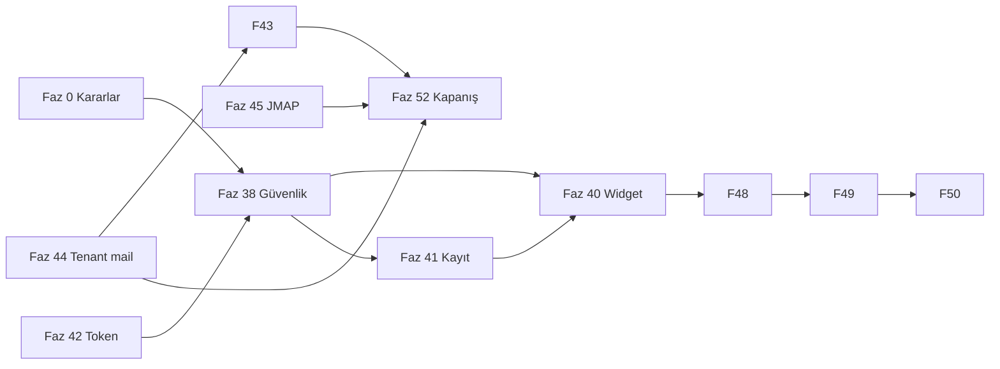

# Posta & Mesajlaşma — %100 tamamlama planı (Wave 3)

**Hedef:** Rakip analizinde listelenen **tüm eksiklerin** kapatılması; **NB Lerta Posta + Mesajlaşma** referansında işlevsel **%100** (bilinçli ürün farkları aşağıda “Faz 0 karar” ile netleştirilir).

**Başlangıç skoru (2026-10-08):** ~**82%** (hub + bağımsız stack güçlü; güvenlik okuma yüzeyi, widget, ops, SaaS polish eksik).

**Bitiş kriteri:** `docs/EKOLOJIK-POSTA-NB-KARSILASTIRMA-CHECKLIST.md` tüm satırlar ✓ + `node scripts/pre-release-qa.mjs` 0 FAIL + `sunucu-ekolojik-posta-tam-kabul.sh` + bu belgedeki **Wave 3 checklist** tamam.

**Önkoşul (tamamlandı):** Wave 1 (Faz 1–24), Wave 2 (Faz 25–37), onboarding 0–6c, mağaza API token (GET/PUT), outbox tenant partition.

**Her faz bitişi (zorunlu):**

```bash
git checkout main && git pull
# … geliştirme branch cursor/posta-fazNN-100-f967 …
bash scripts/agent-deploy.sh   # veya sunucu-market-pos-deploy.sh
node scripts/pre-release-qa.mjs http://<VPS>:5180
bash scripts/ekolojik-posta-faz-kapat.sh "Faz NN (100)" cursor/posta-fazNN-100-f967
```

---

## Faz 0 — Ürün kararları (1 oturum, kod yok)

| # | Karar | Seçenekler | Varsayılan (öneri) |
|---|--------|------------|-------------------|
| 0.1 | **Tam Dovecot webmail / JMAP** | A) Read-only JMAP lite genişlet B) Tam NB webmail klonu C) “Hub yeterli” resmi | **A** — POS’ta tam webmail yok; JMAP read + compose hub |
| 0.2 | **Omnichannel** | WA Business API, SMS, IG | **Faz 47** — önce webhook altyapısı; kanal kanalı |
| 0.3 | **Native mobil** | PWA only vs React Native shell | **PWA + push** (Faz 46); native v2 |
| 0.4 | **Posta okuma auth** | Token zorunlu vs nginx IP allowlist | **Token** (kasiyer read scope + admin full) |

**Çıktı:** `docs/POSTA-MESAJ-100-KARARLAR.md` (Faz 0 onaylandığında doldurulur).

---

## Wave 3 faz haritası (38 → 52)

| Faz | Ad | Hedef % artışı | Öncelik |
|-----|-----|----------------|---------|
| **38** | Güvenlik — Posta okuma & export | +5 | P0 |
| **39** | Ops — outbox failed & izleme | +2 | P0 |
| **40** | Widget & embed (müşteri kanalı) | +6 | P0 |
| **41** | Kayıt → kurulum otomasyonu | +4 | P0 |
| **42** | Oturum — token yenileme & UX | +3 | P0 |
| **43** | Tenant deliverability & DNS sihirbazı | +4 | P1 |
| **44** | Multi-tenant mail E2E & izolasyon | +3 | P1 |
| **45** | JMAP read / gelişmiş klasör senkronu | +5 | P1 |
| **46** | CalDAV/CardDAV tam + PWA push polish | +3 | P1 |
| **47** | Engagement UI (açılma/tıklama) + KVKK metinleri | +2 | P1 |
| **48** | Omnichannel köprü (WA/SMS webhook) | +4 | P2 |
| **49** | AI müşteri bot + agent atama / SLA lite | +4 | P2 |
| **50** | Müşteri self-servis portal (mesaj + ticket) | +3 | P2 |
| **51** | CI, test paketi, staging drift | +2 | P3 |
| **52** | NB checklist %100 + skor kartı kapanış | — | Final |

**Toplam hedef:** 82% → **100%** (ölçüm: `docs/RAKIP-SKOR-KARTI.md` — Faz 52’de oluşturulur).

---

## Faz 38 — Güvenlik: Posta okuma & export

**Amaç:** Anonim `GET /api/posta/*` (inbox, export, settings) kapatılması; rol bazlı okuma.

| # | İş | Dosya / API |
|---|-----|-------------|
| 38.1 | `requirePosReadAuth` — `posta` sekmesi olan kullanıcı veya admin | `server/posApiAuth.mjs`, `server.mjs` |
| 38.2 | Koruma: inbox, sent, search, export.*, storage, rules GET, settings GET | route listesi `server.mjs` |
| 38.3 | İstemci: Posta hub fetch’lere `posApiAuthHeaders` | `posta*Service.ts`, hub screen |
| 38.4 | Rate limit (IP + token) — abuse | `server/rateLimit.mjs` (yeni, hafif) |
| 38.5 | Audit log: hassas export | `data/audit/posta-access.jsonl` |

**Kabul:** Anonim inbox → **401**; `pre-release-qa.mjs` genişletilmiş güvenlik maddeleri PASS.

---

## Faz 39 — Ops: outbox failed & sağlık

**Amaç:** VPS’teki yüzlerce `failed` kayıt; operatör görünürlük.

| # | İş | Çıktı |
|---|-----|--------|
| 39.1 | Hub: failed listesi + toplu requeue / arşiv | UI + mevcut `requeueFailedOutboxMessage` |
| 39.2 | `scripts/sunucu-ekolojik-outbox-failed-arsivle.sh` tenant-aware | cron dokümantasyonu |
| 39.3 | Kök neden raporu (SMTP hata sınıfları) | `GET /api/posta/outbox/analytics` genişletme |
| 39.4 | Alert: failed > eşik → ops e-posta (matris) | `postaOutboxNotify` |

**Kabul:** Prod’da failed sayısı trendi düşer; haftalık cron kayıtlı.

---

## Faz 40 — Widget & embed (%55 → %100 müşteri kanalı)

**Amaç:** Dokümandaki `messaging.js` gerçekten sunulsun; onboarding adım 2 doğrulansın.

| # | İş | Çıktı |
|---|-----|--------|
| 40.1 | `public/widget/messaging.js` — snippet ile uyumlu loader | Vite/public veya statik |
| 40.2 | `GET /widget/messaging.js` nginx + cache | deploy script |
| 40.3 | Widget: tenant id + public key, thread oluştur, SSE/ poll | `publicApi.mjs` |
| 40.4 | Sihirbaz: “Widget test et” — canlı önizleme iframe | `PostaOnboardingWizard.tsx` |
| 40.5 | CORS + origin allowlist (tenant config) | `messaging/publicConfig.mjs` |

**Kabul:** Harici statik HTML’den widget ile mesaj POS Sohbet’e düşer.

---

## Faz 41 — Kayıt → kurulum otomasyonu

**Amaç:** `registerTenant` sonrası tam akış; plan maddelerindeki boşluklar.

| # | İş | Çıktı |
|---|-----|--------|
| 41.1 | Kayıt: `postaOnboarding.status=pending`, `registrationEmail` | `tenantAuth.mjs` (çoğu var — doğrula) |
| 41.2 | Kayıt UI: “İlk girişte Posta kurulumu” metni | `LandingRegister.tsx` |
| 41.3 | İlk giriş: sihirbaz zorunlu (admin) — dismissed hariç | `PosApp.tsx` |
| 41.4 | Adım 1: IMAP/SMTP “Bağlantıyı test et” zorunlu opsiyon | wizard + health API |
| 41.5 | Adım 2: widget kuruldu bayrağı (`messagingEmbed.done`) | otomatik test endpoint |

**Kabul:** Yeni tenant E2E: kayıt → giriş → sihirbaz → posta sekmesi → gelen test.

---

## Faz 42 — Oturum: token yenileme

**Amaç:** 24h token + sayfa yenileme; giriş sonrası senkron kırılmasın.

| # | İş | Çıktı |
|---|-----|--------|
| 42.1 | `POST /api/auth/pos-token/refresh` — süresi dolmak üzere yenile | `posApiAuth.mjs` |
| 42.2 | İstemci: `refreshPosApiToken` periyodik + 401 retry | `posApiAuth.ts`, `useStore` |
| 42.3 | Oturum varken token yoksa sessiz refresh (refresh token veya şifre isteme **yok**) | sliding session cookie **opsiyonel** — karar 0.4 |

**Kabul:** 8 saat açık sekme sonrası PUT/GET hâlâ çalışır (yenileme ile).

---

## Faz 43 — Tenant deliverability & DNS

**Amaç:** Global `EKOLOJIK_MAIL_DOMAIN` yerine mağaza From domain rehberi.

| # | İş | Çıktı |
|---|-----|--------|
| 43.1 | `getPostaDeliverabilityHub(dataDir, tenantId)` — From domain tenant | kısmen var — UI |
| 43.2 | Sihirbaz + Ayarlar: SPF/DKIM/DMARC kopyala-yapıştır checklist | wizard adım 1 genişletme |
| 43.3 | Alias env → tenant `settings.postaAliases` | seed onboarding |
| 43.4 | DNS doğrulama: `EKOLOJIK_DNS_STRICT` tenant bazlı | script genişletme |

**Kabul:** Yeni mağaza kendi domain’i ile deliverability paneli yeşil veya “eksik” listesi.

---

## Faz 44 — Multi-tenant mail E2E

**Amaç:** CRM, contact, messaging notify, deliverability, presentation — **her zaman** doğru `tenantId`.

| # | İş | Çıktı |
|---|-----|--------|
| 44.1 | Tüm `sendEkolojikMail` çağrıları audit | grep + fix |
| 44.2 | `getPostaMailSettings` → tenant override (ops e-posta) | `postaSettings.mjs` |
| 44.3 | Outbox processor: tenant başına limit / adil kuyruk | `emailOutbox.mjs` |
| 44.4 | E2E script: 2 tenant paralel mail | `scripts/e2e-tenant-mail.mjs` |

**Kabul:** `e2e-tenant-mail.mjs` PASS; yanlış tenant From **0** vaka.

---

## Faz 45 — JMAP read & klasör derinliği

**Amaç:** Faz 0.1 **A** — tam webmail değil, NB “okuma” paritesi.

| # | İş | Çıktı |
|---|-----|--------|
| 45.1 | JMAP lite: mailbox list + message fetch (read-only) | mevcut endpoint genişlet |
| 45.2 | IMAP MOVE tüm klasörler (Sent/Junk/Drafts) — regression test | Faz 14 sağlamlaştırma |
| 45.3 | Hub: “Sunucu klasörü” ile bayrak uyumu | `postaInbox.mjs` |
| 45.4 | Dokümantasyon: webmail yerine hub | `EKOLOJIK-POSTA-KULLANIM.md` |

**Kabul:** NB checklist #13–14 ✓; JMAP smoke script PASS.

---

## Faz 46 — CalDAV/CardDAV tam + push

| # | İş | Çıktı |
|---|-----|--------|
| 46.1 | CalDAV: iki yön etkinlik (lite → tam) | Faz 28 üzerine |
| 46.2 | CardDAV: kişi export/import | Faz 17 |
| 46.3 | Web push: iOS PWA rehberi + test butonu | Ayarlar |
| 46.4 | `posta/ws` gateway: mesaj gecikme metrikleri | Faz 32 polish |

---

## Faz 47 — Engagement & KVKK

| # | İş | Çıktı |
|---|-----|--------|
| 47.1 | Açılma/tıklama dashboard (env açıkken) | hub analytics |
| 47.2 | Müşteri otomatik e-postada izleme onayı metni | şablon + ayar |
| 47.3 | Bounce CSV export tenant filtre | export API |

---

## Faz 48 — Omnichannel (WA / SMS)

| # | İş | Çıktı |
|---|-----|--------|
| 48.1 | `server/integrations/channelWebhook.mjs` — pluggable | |
| 48.2 | WhatsApp Cloud API veya Twilio adapter (1 kanal) | env |
| 48.3 | Thread `channel=whatsapp` — hub badge | messaging store |
| 48.4 | Operatör: kanal bağlama Ayarlar | UI |

**Not:** İkinci kanal (SMS) Faz 48b veya 49 öncesi.

---

## Faz 49 — AI bot & agent atama

| # | İş | Çıktı |
|---|-----|--------|
| 49.1 | Müşteri bot: FAQ + handoff to staff | `messaging/bot.mjs` |
| 49.2 | Thread `assignedUserId`, durum: açık/beklemede/kapalı | UI + API |
| 49.3 | SLA: ilk yanıt süresi metrik | rapor |
| 49.4 | `postaAiCompose` ile tutarlı model config | ayarlar |

---

## Faz 50 — Müşteri portal

| # | İş | Çıktı |
|---|-----|--------|
| 50.1 | `/portal/mesajlar` — magic link veya public key | landing route |
| 50.2 | Ticket durumu + e-posta bildirimi | notify |
| 50.3 | İletişim formu ↔ thread birleştirme | contact + messaging |

---

## Faz 51 — Kalite & CI

| # | İş | Çıktı |
|---|-----|--------|
| 51.1 | `npm test` → `pre-release-qa.mjs` + unit (outbox, auth) | `package.json` |
| 51.2 | GitHub Actions / deploy öncesi QA | workflow |
| 51.3 | `release/staging/server.mjs` kaldır veya sync job | tek kaynak |
| 51.4 | `pre-release-qa` Faz 38–44 maddeleri | script |

---

## Faz 52 — Kapanış: %100 doğrulama

| # | İş | Çıktı |
|---|-----|--------|
| 52.1 | `EKOLOJIK-POSTA-NB-KARSILASTIRMA-CHECKLIST.md` — tüm ✓ | |
| 52.2 | `docs/RAKIP-SKOR-KARTI.md` — kategori %100 | |
| 52.3 | `sunucu-ekolojik-posta-tam-kabul.sh` + UI yürüyüş 30 dk | |
| 52.4 | `EKOLOJIK-POSTA-PARITE-TAMAMLANDI.md` güncelle — Wave 3 kapandı | |

---

## Wave 3 master checklist

```
[x] Faz 0 — Kararlar dokümanı onaylandı (`docs/POSTA-MESAJ-100-KARARLAR.md`)
[x] Faz 38 — Posta GET/export auth
[x] Faz 39 — Outbox ops
[x] Faz 40 — Widget
[x] Faz 41 — Kayıt otomasyon
[x] Faz 42 — Token refresh
[x] Faz 43 — Tenant DNS
[x] Faz 44 — Tenant mail E2E
[ ] Faz 45 — JMAP/klasör
[ ] Faz 46 — CalDAV + push
[ ] Faz 47 — Engagement KVKK
[ ] Faz 48 — Omnichannel
[ ] Faz 49 — Bot + SLA
[ ] Faz 50 — Müşteri portal
[ ] Faz 51 — CI
[ ] Faz 52 — %100 kapanış
```

---

## Bağımlılık sırası (kritik yol)



**Önerilen uygulama sırası:** 0 → **38 → 39 → 42 → 41 → 40 → 43 → 44 → 45 → 46 → 47 → 48 → 49 → 50 → 51 → 52**.

---

## İlgili belgeler

| Belge | Rol |
|-------|-----|
| [PLAN-EKOLOJIK-POSTA-NB-PARITE.md](./PLAN-EKOLOJIK-POSTA-NB-PARITE.md) | Wave 1 |
| [PLAN-EKOLOJIK-POSTA-NB-WAVE2.md](./PLAN-EKOLOJIK-POSTA-NB-WAVE2.md) | Wave 2 (Faz 25–37) |
| [PLAN-EKOLOJIK-POSTA-KAYIT-ONBOARDING.md](./PLAN-EKOLOJIK-POSTA-KAYIT-ONBOARDING.md) | Onboarding (6c tamam) |
| [PRE-RELEASE-QA-RAPOR.md](./PRE-RELEASE-QA-RAPOR.md) | Teslim testleri |
| [EKOLOJIK-POSTA-NB-KARSILASTIRMA-CHECKLIST.md](./EKOLOJIK-POSTA-NB-KARSILASTIRMA-CHECKLIST.md) | NB satır satır |

---

*Oluşturulma: 2026-10-08 — rakip analizi eksik listesinin faz faz uygulama planı.*
