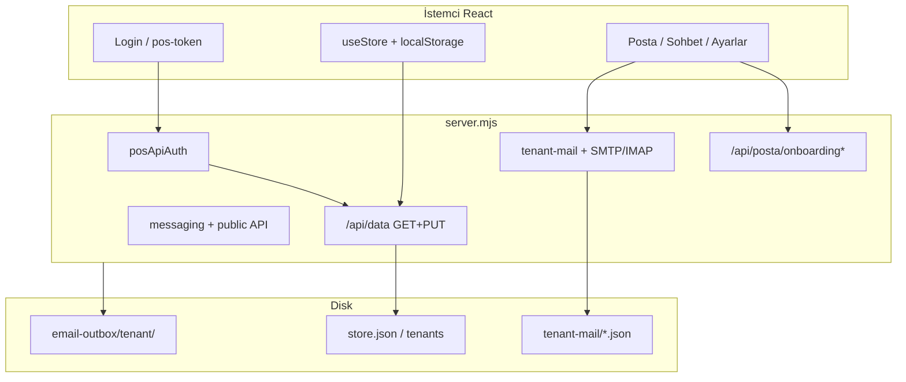

# Ekolojik Market POS — Teslim öncesi test raporu

**Tarih:** 2026-10-08  
**Ortam:** VPS `http://168.231.109.27:5180` (PM2 `market-pos`, branch `main`, commit `0564581` civarı)  
**Otomasyon:** `node scripts/pre-release-qa.mjs http://168.231.109.27:5180`  
**Ham JSON:** `docs/PRE-RELEASE-QA-REPORT.json`

---

## 1. Executive özet

| Alan | Sonuç |
|------|--------|
| Statik derleme / kod paritesi | **Geçti** |
| Güvenlik (mağaza API token) | **Geçti** (anonim GET/PUT 401) |
| Auth + senkron (token ile) | **Geçti** (`yonetici` / VPS şifresi) |
| Posta & mesajlaşma API uçları | **Geçti** (smoke GET + admin POST) |
| Outbox tenant partition (modül) | **Geçti** |
| UI smoke (giriş, panel, posta, ayarlar) | **Geçti** (ilk girişte zorunlu şifre değişimi) |
| Otomasyon özeti | **29 PASS / 0 FAIL / 0 WARN** (son VPS koşusu) |

**Genel karar:** Üretim kullanımına **verilebilir**, aşağıdaki operasyon ve bilinen risk maddeleriyle birlikte.

---

## 2. Test kapsamı matrisi

### 2.1 Statik / yapı bütünlüğü

| Test | Açıklama | Sonuç |
|------|----------|--------|
| `sunucu-ekolojik-kod-parite-dogrula.sh` | Kritik Posta dosyaları + `npm run build` | OK |
| `node --check server.mjs` | Sunucu sözdizimi | OK |
| TypeScript (`tsc -b` build içinde) | İstemci tip kontrolü | OK |
| Modül bağlantıları | `server.mjs` → posta, messaging, tenant-mail, posApiAuth, emailOutbox | Deploy + parite script ile doğrulandı |

### 2.2 Güvenlik / kırılma (regresyon)

| Senaryo | Beklenen | VPS sonucu |
|---------|----------|------------|
| Anonim `GET /api/data` | 401 | 401 |
| Anonim `PUT /api/data` | 401 | 401 |
| Anonim `PATCH /api/posta/onboarding` | 401 | 401 |
| Anonim `PUT /api/posta/tenant-mail` | 401 | 401 |
| Geçersiz Bearer token | 401 | 401 |
| `POST /api/auth/pos-token` yanlış şifre | 401 | 401 |
| Token ile `GET /api/data` | 200, **passwordHash yok** | OK |
| Token ile `PUT /api/data` | 200 | OK |
| Admin token ile `PATCH` onboarding | 200 | OK |

### 2.3 Posta & entegrasyon (canlı API)

Deploy sırasında çalışan **`sunucu-ekolojik-posta-parite-dogrula.sh`** kapsamı (özet):

- SMTP / IMAP health
- Gelen kutusu klasörleri (gelen, fatura, spam, yıldızlı, arama)
- Kurallar, storage, deliverability, drafts, calendar, messaging threads
- Export CSV/ZIP, SSE `/api/posta/events`
- `LERTA_PLATFORM_BRIDGE=0` (NB köprüsü kapalı)

QA script ek olarak: onboarding hub, tenant-mail, public-config, contact form POST.

### 2.4 E-posta outbox (yapı)

- Yerel modül testi: `pending/{tenantId}/` altına yazım + işleme **OK**
- VPS sayaçları (örnek koşu): `pending: 12`, `sent: 16`, **`failed: 1533`** → operasyonel temizlik önerilir (`scripts/sunucu-ekolojik-outbox-failed-arsivle.sh` veya hub’dan retry politikası)

### 2.5 UI smoke (manuel)

| Adım | Sonuç |
|------|--------|
| `/giris` yükleme | OK |
| `yonetici` + şifre ile giriş | OK |
| İlk giriş **şifre değiştir** modalı | Beklenen (güvenlik); test sırasında tamamlandı |
| `/app` shell, sekmeler | OK |
| Posta Merkezi | OK (inbox, 502 yok) |
| Ayarlar | OK |
| Satış / ürün grid | OK |

**Not:** Smoke test sırasında VPS’te `yonetici` şifresi değiştirilmiş olabilir. Teslim öncesi **bilinen şifreyi** siz netleştirin veya “şifremi unuttum” sürecini dokümante edin.

**Konsol:** Giriş öncesi veya token yokken `GET /api/data` → **401** (beklenen); giriş sonrası senkron normale döner.

---

## 3. Mimari / bağlantı değerlendirmesi



**Bütünlük:** Onboarding → tenant-mail → outbox → SMTP/IMAP zinciri tenantId ile hizalı. Legacy onboarding migrasyonu yalnızca onboarding GET + deploy script (her `readStoreData` değil).

---

## 4. Bilinen riskler (teslim notu)

| Öncelik | Konu | Açıklama |
|---------|------|----------|
| Orta | Posta GET uçları | Inbox, settings, deliverability vb. hâlâ **anonim GET** (POS modeli: ağ içi güvenilirlik). İnternete açık VPS’te nginx/IP kısıtı veya ileride read-token düşünün. |
| Orta | `failed` outbox hacmi | 1500+ kayıt — disk ve hub gürültüsü; arşiv/temizlik |
| Düşük | Otomatik `lint`/`test` script yok | Teslim sonrası `pre-release-qa.mjs` ile periyodik koşun |
| Düşük | Bundle boyutu | Vite ~1.5 MB JS uyarısı (performans, işlev değil) |
| Bilgi | İlk giriş şifre değişimi | `mustChangePassword` — kullanıcı eğitiminde belirtin |

**Güçlü yanlar:** Mağaza verisi GET/PUT token korumalı; hash sızıntısı kapalı; hassas POST/PATCH admin token; tenant outbox dizinleri; tenant mail şifreleri diskte şifreli.

---

## 5. Teslim öncesi operatör checklist

1. [ ] VPS `.env`: `EKOLOJIK_POS_API_SECRET` (veya `data/pos-api-secret` yedeklendi)
2. [ ] `pm2 status market-pos` → online
3. [ ] `node scripts/pre-release-qa.mjs http://<host>:5180` → 0 FAIL
4. [ ] Outbox failed temizliği / arşiv
5. [ ] Admin şifreleri bilinen değerlere ayarlandı (smoke sonrası kontrol)
6. [ ] Kullanıcıya: Ctrl+F5, giriş → token → senkron; Posta = işletme kutusu eğitimi (`docs/EKOLOJIK-POSTA-ONBOARDING-OPERATOR.md`)

---

## 6. Tekrar çalıştırma

```bash
# Statik + VPS canlı (URL’yi değiştirin)
node scripts/pre-release-qa.mjs http://168.231.109.27:5180

# Sadece kod + build
bash scripts/sunucu-ekolojik-kod-parite-dogrula.sh

# VPS’te tam Posta paritesi (sunucuda)
bash scripts/sunucu-ekolojik-posta-parite-dogrula.sh /var/www/market-pos
```

---

*Bu rapor otomasyon + UI smoke + deploy doğrulama çıktılarına dayanır; mali yazıcı (inpos-bridge) ve harici TCMB/ASAT proxy’leri bu koşuda test edilmedi.*
